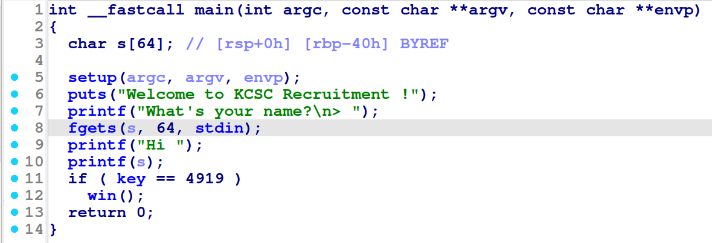

# WRITEUP KCSC RECRUITMENT

# 01. welcome (pwn)

### a. Phân tích challenge

- Đầu tiên ta phân tích chương trình bằng IDA:



- Khi biến key (biến toàn cục) có giá trị bằng 4919 (0x1337) thì hàm win() được gọi và ta có system():


- Vậy mục tiêu của ta là gọi tới được hàm win() bằng cách thay đổi giá trị của biến key. Dễ thấy hàm printf(s) xảy ra lỗi format string nên ta có thể tận dụng để thay đổi giá trị của biến key

### b. Tiến hành khai thác

- Bước 1: quét ngăn xếp để tìm offset: vùng nhớ của printf() nằm dưới vùng nhớ của main() nên khi quét ngăn xếp từ dưới lên với các yêu cầu định dạng %p thì đến một lúc nào đó sẽ gặp lại biến s ⇒ từ đó tìm được offset:


      ⇒ Giá trị dưới dạng chuỗi của 0x70252c là “%p,” nên offset =6

- Bước 2: tìm địa chỉ của biến key. Debug chương trình bằng GDB tìm được địa chỉ của biến key là 0x40408c:


- Bước 3: Viết payload. Ta có thể tận dụng các yêu cầu định dạng %hhn và %lln để tạo payload ghi giá trị 0x1337 vào biến key. Tuy nhiên để thuận tiện ta dùng hàm fmstr_payload của pwntools để tạo payload:


- Bước 4: Chạy script và cat flag:


# 02. aaa (pwn)

### a. Phân tích challenge

- Đầu tiên ta phân tích chương trình bằng IDA:


- Nếu biến is_admin có giá trị bằng 1 thì chương trình sẽ in ra flag. is_admin là một biến nằm trong phân vùng .bss. Phân vùng này dùng để lưu trữ các biến tĩnh hoặc các biến toàn cục được khai báo mà không khởi tạo giá trị:


- Ngoài ra thì mảng buf cũng nằm trong phân vùng .bss và có địa chỉ thấp hơn biến is_admin:


## b. Tiến hành khai thác

- Vì dữ liệu được ghi từ địa chỉ thấp lên địa chỉ cao nên khi buf bị tràn thì nó sẽ tràn dữ liệu sang biến is_admin trong phân vùng .bss
- Vậy ta chỉ cần nhập biến buf thật dài để tràn lên is_admin và nhận được flag:


# 03. crypto1 (crypto)

- Phân tích đề bài ta thấy chúng ta cần phải giải mã một thông điệp được mã hóa bằng thuật toán RSA
- Đọc file code python ta có được giá trị của e là 0x10001. Dựa vào đoạn comment ta còn có thêm được giá tri của n, của c và 2 giá trị khác không rõ là giá trị gì
- Quay trở lại file code, chú ý đến 2 dòng code sau:


- Ta có thể dự đoán rằng 2 giá trị không rõ kia có thể chính là giá trị của hệ phương trình này. Vậy nếu giải được hệ phương trình đó thì sẽ tìm ra được p và q
- Dùng thư viện toán học Sympy của python để giải hệ phương trình trên:

```python
from sympy import symbols, Eq, solve
p, q = symbols('p q')
eq1 = Eq(13*q**2 + 5*p*q + 2*p**5, 99070322718633589075437462797565157261778565342202176866775343970398558639214129862647491552411934954337080928975984888590350647667063750589996693551004764949048370796506334502440334616612079528441181921243264137829513725003752633040825654275249100544290948338516838946174770287568358642193272862193796894044937197882972942736350187023160283258646203934697126833099845086570117310993425665455046278368788256843647321433937611726466080931200057154600456738627871172358125025243308598393199170155505096434440339433895197600955266878886512068835988415711337072167542113641557473147599428014808952558696371214362762804029219711275834667722478355607836912560341298862576500518929722837267759516608623300378294362866958920710706131156072317563285732965572961520111862487408104)
eq2 = Eq(7*q**3 + p**3, 4053829493753080394597319030520465552249075460276768487813206903952134102796024072650537404512981555893331018255239607908419904554570951529767887735220350920134963507895001907309725345634404748146887358629605419756823088475689769294303699918630919892363333011358649952996211367887394670736389996674537151867058156643368735877078538193576703224594833465330136899282032495128158051461158831558808541670885217172490157676355847572589184884710346372276161554121356404)
solution = solve((eq1, eq2), (p, q))
print(solution)
```

- Sau khi chạy thì ta nhận được 2 giá trị là p và q:


- Dùng công cụ [RSA Cipher Calculator - Online Decoder, Encoder, Translator](https://www.dcode.fr/rsa-cipher) để giải mã RSA ta nhận được flag:


# 04. babyrop (pwn)

- Đầu tiên pwninit để tạo môi trường khai thác với libc và phân tích chương trình bằng IDA:


- Mảng s giới hạn 64 ký tự nhưng fgets() cho nhập tới 4919 ký tự nên ta có thể tận dụng lỗi buffer ovreflow. Tuy nhiên hàm if lại kiểm tra độ dài của s để tránh điều này ⇒ Ta có thể tận dụng ký tự null để lách được vì hàm strlen() trong C sẽ không đếm các ký tự trong chuỗi sau khi gặp dấu kết thúc null (’\0’)
- Tính offset từ mảng s đến saved rbp: hàm main chỉ có duy nhất một mảng cục bộ s chiếm 64 byte, mà 64 chia hết cho 8 (đảm bảo stack align) nên offset từ mảng s đến saved rbp là 64 byte. Thử check lại:


(Vì \0 là ký tự đặc biệt nên ta truyền bằng pipe, ở đây ta truyền vào một chuỗi lớn hơn 64 ký tự nhưng chương trình không bị exit và vẫn in ra được thông điệp puts ⇒ thành công tận dụng dấu kết thúc)

- Chạy lại đoạn payload trên vào gdb thì ta check được offset tới rbp = 64 như đã dự đoán:


- Vì không có hàm nào gọi đến shell nên ta phải tự tạo shell bằng ROP. Dùng Ropgadget để tìm các gadget pop rdi thì không tìm được:


⇒ P/s: sau khi làm đến đây thì e tìm thêm các cách khai tiếp đều không thành công, cho đến khi tìm được list bài giảng của a JHT trên youtube thì e có làm theo bài libc mở rộng (video 8) nhưng đến đoạn 13p10s truyền puts@got vào puts@plt thì e ko làm đc do puts trong bài này đã có sẵn dữ liệu truyền vào, e vẫn chưa nghĩ ra đc cách để khắc phục ạ :(